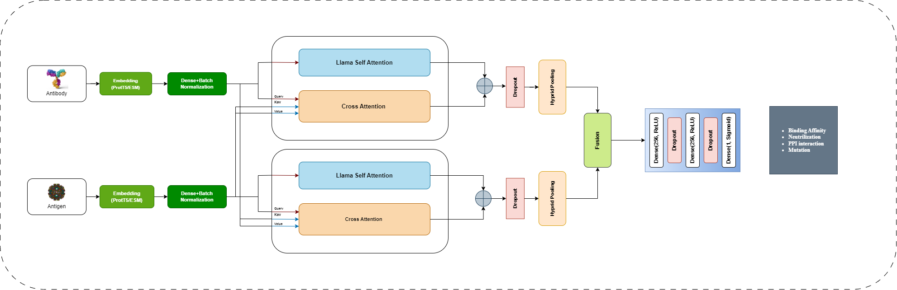

# DualCrossNet

## Overview

**DualCrossNet** is a dual-stream cross-attention framework designed for antibody–antigen modeling tasks, including neutralization prediction, binding affinity estimation, protein–protein interaction (PPI) analysis, and binding free energy change prediction.

\---

## Architecture




\---

## Installation

* PyTorch = 2.4.1
* Tensorflow = 2.19.1
* Cuda = 12.4
* GPU = NVIDIA A100 80GB PCIe

### Environment Setup

Two Conda environments are used for reproducibility and modularity.

#### 1\. Feature Extraction Environment

```bash
conda env create -f llm\_tor2.yaml
conda activate llm\_tor2
```

> This environment is used for protein language model–based feature extraction (ProtT5, ESM-2, SeqVec).

#### 2\. Training Environment

```bash
conda env create -f antibody\_dl\_environment.yaml
conda activate antibody\_dl\_environment
```

> This environment supports deep learning model training, cross-attention modules, and evaluation workflows.

\---

### Datasets

### Ag–Ab Neutralization Datasets

The HIV antibody neutralization data were obtained from the [HIV Sequence Database](https://www.hiv.lanl.gov/components/sequence/HIV/neutralization/). To reduce redundancy and ensure diversity, Ag–Ab pairs with sequence homology greater than 90% for both antigens and antibodies were excluded. The final curated dataset consists of **24,907 neutralizing antibody–antigen pairs** and **26,480 non-neutralizing pairs**, forming a large-scale benchmark for HIV neutralization prediction.

### Antibody–Antigen Affinity

The [SAbDab](https://academic.oup.com/nar/article/42/D1/D1140/1044118) database is a curated repository of experimentally resolved antibody–antigen (Ag–Ab) complexes collected from the Protein Data Bank (PDB). For the binding prediction task in this study, we selected complexes with antigen sequences longer than 50 residues and removed redundant entries based on antibody CDR loop similarity. After filtering, a total of **1,513 unique Ag–Ab binding pairs** were retained and used as the SAbDab dataset.


### Protein–Protein Interaction (PPI) Dataset

**Human Protein–Protein Interaction (PPI) Dataset**
The intra-species human PPI dataset includes **36,630 interacting protein pairs** collected from the [Human Protein Reference Database (HPRD)](http://www.hprd.org/) and **36,480 non-interacting pairs** obtained from the [LR\_PPI dataset](http://www.csbio.sjtu.edu.cn/bioinf/LR_PPI/Data.htm). Non-interacting samples were generated by pairing proteins localized in different subcellular compartments, minimizing the likelihood of true interactions.

**Yeast PPI Dataset**
The *Saccharomyces cerevisiae* (yeast) core PPI dataset was downloaded from the [Database of Interacting Proteins (DIP)](https://dip.doe-mbi.ucla.edu/) (version 20,070,219). This dataset provides experimentally validated protein–protein interactions and is widely used for benchmarking PPI prediction models.

\---

## Training

### Code Structure (Scripts and Notebooks)

```text
script/
├── HIV-RELAAI-SeqVec-FeatureExtraction.ipynb
├── HIV-RLEAAI-Full-FeatureExtraction-ProtT.ipynb
├── LR_PPI-Human-FeatureExtraction-ProtT5.ipynb
├── Negative-Sampling-SabDab.ipynb
├── SabDab2-RELAAI-ESM2-FeatureExtraction.ipynb
├── Yeast-Full-FeatureExtraction-ProtT5.ipynb
├── interp_comprehensive_interpretability_v5.ipynb
├── train_ablation_no_crossattn_Yeast.py
├── train_ablation_singleStream_LLaMA_Yeast.py
├── train_optimized-HIV.py
├── train_optimized-Human.py
├── train_optimized-SabDab.py
├── train_optimized-Yeast.py
└── train_optimized-sars.py
```

> These scripts and notebooks cover feature extraction using multiple protein language models, dataset-specific training pipelines, ablation studies, K-fold cross-validation, and visualization/interpretability utilities.

\---

## Citation


> Citation information will be added here. Please cite the corresponding paper if you use this code or framework.

```bibtex
@article{LlamaCrossAttn2026,
  title   = {A Dual-Stream AI Framework for Multi-Perspective Antibody Functional Landscapes
},
  author  = {Delower Hossain, Jake Y Chen},
  journal = {Journal to be added},
  year    = {2026}
}
```

